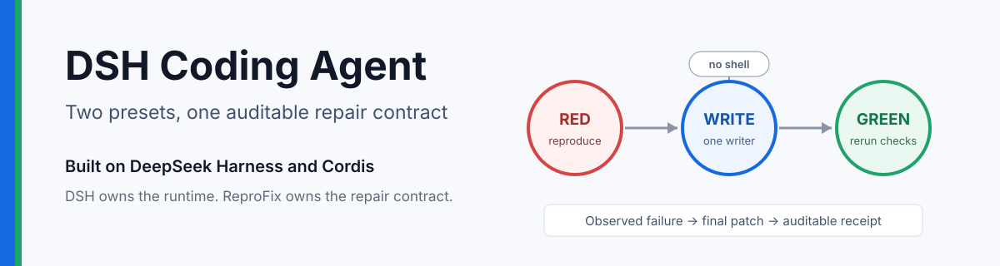
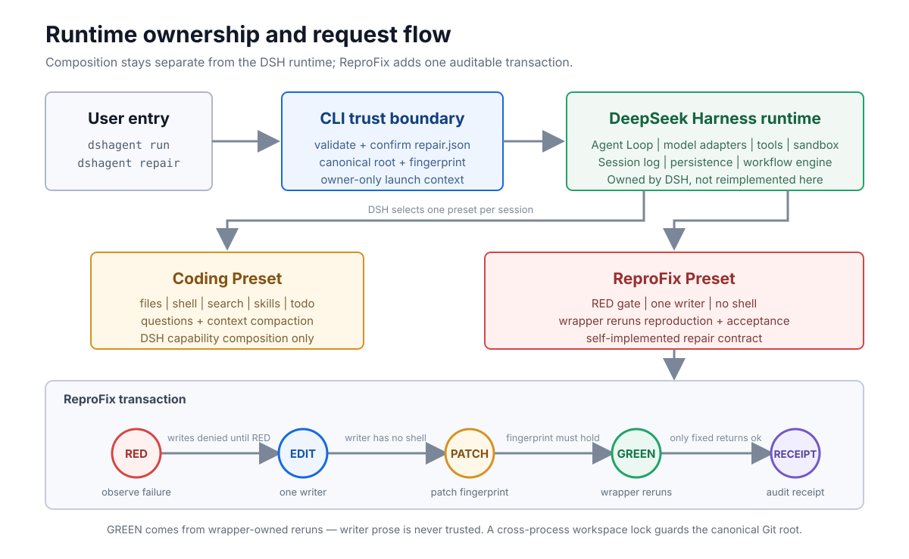
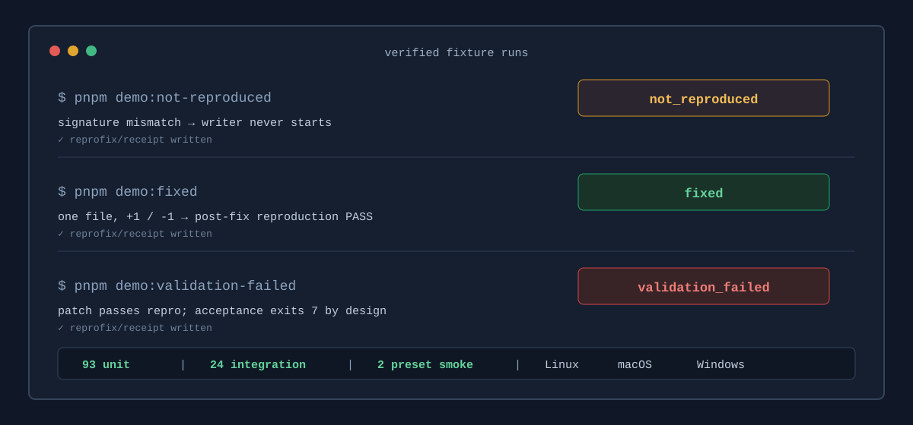

# DSH Coding Agent

[Simplified Chinese](README.md) | **English**

[](https://github.com/still0123/dsh-coding-agent/actions/workflows/ci.yml)
[](https://github.com/still0123/dsh-coding-agent/releases/latest)
[](LICENSE)
[](https://github.com/deepseek-ai/deepseek-harness)



## When a coding agent claims "fixed", who verifies it?

General-purpose coding agents rely on model cooperation for correctness. The
prompt asks them to reproduce, repair, then verify, but the model may skip
reproduction and start editing immediately; it reports "tests pass" although
nothing re-ran them independently; and when the task ends, no durable evidence
of what happened remains.

dsh-coding-agent turns that convention into an **auditable execution
contract**, enforced by code instead of natural language:

> **Observe the user-declared failure on the current machine (RED) before
> unlocking exactly one writer to modify code. After the repair, the wrapper
> itself reruns the reproduction and every acceptance command. Only when the
> patch fingerprint is unchanged during validation and every check passes does
> the run return `fixed`.**

The flow has nine terminal states. Only `fixed` returns `ok: true`; every other
state returns with its reason and evidence.

The project is built on **DeepSeek Harness / Cordis (DSH)**, which provides the
Agent Loop, model adapters, tool sandbox, Session, and persistence. This
project does not reimplement them; it implements Presets, the CLI authorization
boundary, the ReproFix Guard, the state machine, and Receipts on official DSH
extension points.

## Why "just write it in the prompt" is not enough

Prompt-level constraints are probabilistic: the model follows them most of the
time. ReproFix replaces that trust with mechanical guarantees:

| Prompt-driven agents | ReproFix execution contract |
| --- | --- |
| Asking the model to "reproduce first" — it may still start editing right away | RED gate: until the failure signature matches, `write`, `edit`, `bash`, `pwsh`, and unknown tools are denied by the Guard |
| The model reports "tests pass" — nothing verifies it actually ran them | GREEN comes from the plugin rerunning the reproduction and every acceptance command; writer prose is never trusted |
| Truncated or timed-out output can be misread as success | Truncation, timeout, cancellation, or sandbox denial can never serve as RED / GREEN evidence |
| When the task ends only a chat log remains — hard to audit | Every terminal state writes a `reprofix/receipt`: exit codes, output digests, patch fingerprint, validation details |

## How ReproFix Works

ReproFix registers one model-facing DSH tool:

```text
repair_failure
```

When invoked, the plugin:

1. Resolves the canonical Git root.
2. Rejects a workspace containing tracked or untracked changes.
3. Runs `repro.command`.
4. Matches both the exit-code rule and every case-sensitive `outputIncludes`
   literal.
5. Unlocks edit/write for exactly one writer only after a match; Shell remains
   unavailable.
6. Starts at most one writer Agent to diagnose and patch the code.
7. Reruns the reproduction and up to 10 acceptance commands through the
   wrapper.
8. Compares HEAD and patch fingerprints before and after validation.
9. Appends a `reprofix/receipt` event to the DSH Session.

`failureLog` is diagnostic context only. It can never replace a reproduction
observed on the current machine.

## Mechanical Guarantees

These properties are enforced by code rather than writer prose:

- A dirty workspace cannot start reproduction or a writer.
- Truncated, timed-out, cancelled, sandbox-denied, or unstarted commands cannot
  satisfy RED or GREEN.
- RED requires both the exit-code rule and every output literal.
- Before RED, the Guard denies `write`, `edit`, `bash`, `pwsh`, and unknown
  tools.
- After RED, writer capability tools remain limited to `read`, `glob`, `grep`,
  `edit`, and `write`, plus DSH's `structured_output` completion channel. Bash,
  PowerShell, and arbitrary command tools remain denied.
- A lock under `$DSH_HOME/dsh-coding-agent/locks` excludes concurrent processes
  targeting the same canonical Git root.
- HEAD is checked after reproduction, the writer, and validation.
- GREEN is produced only by wrapper-owned command execution.
- Tracked diffs and untracked files both enter the versioned patch fingerprint.
- A validation-time patch change prevents `fixed`.
- Every controlled terminal path attempts a `reprofix/receipt`; persistence
  failures are reported to stderr.

Each output stream is retained up to 256 KiB. Any truncation makes matching fail
closed instead of inferring success from incomplete evidence.

## Architecture and Ownership



| DSH provides | This project implements |
| --- | --- |
| Agent Loop, model adapters, tool runtime | `coding` / `reprofix` Agent Presets |
| ALLOW / ASK / DENY, Sandbox, Shell | `repair.json` CLI authorization and fingerprint |
| Session log, persistence, Workflow | RED gate, one writer, wrapper validation |
| Context compaction and Web UI | Canonical workspace lock and Receipt |

See [Architecture](docs/architecture.md), [ADRs](docs/adr/README.md), and
[SPEC](SPEC.md) for the detailed design.

## Built-in Agent Presets

The repository ships two isolated modes:

| Preset | Purpose | Capabilities |
| --- | --- | --- |
| `DSHAgent` | General coding tasks | Files, Shell, search, Skills, Todo, questions, and context compaction |
| `ReproFix` | Failures with a stable reproduction | Exact RED gate, one writer, independent validation, and Receipt |

`DSHAgent` does not mount the ReproFix Guard. Before RED, `ReproFix` rejects
mutation. After RED, the writer's capability tools remain limited to
read/search/edit/write, plus DSH's structured-result completion channel. Every
command remains wrapper-owned.

## Result Statuses

| Status | Meaning |
| --- | --- |
| `fixed` | Exact RED observed; the final patch passed reproduction and every acceptance check without changing during validation |
| `not_reproduced` | Current command output did not match the declared failure; no writer started |
| `blocked_dirty_workspace` | Workspace was dirty at startup; no reproduction or writer ran |
| `blocked_repro_side_effect` | Reproduction changed the workspace or HEAD; no writer started |
| `blocked_active_run` | Another process sharing the same `DSH_HOME` holds the canonical-root lock |
| `repair_failed` | The writer produced no validatable patch or its Workflow failed |
| `validation_failed` | A patch exists, but reproduction, acceptance, HEAD, or fingerprint validation failed |
| `cancelled` | The host cancelled the run or command execution was aborted |
| `infrastructure_error` | Git, the lock directory, Session persistence, model adapter, or another local dependency prevented completion |

Only `fixed` returns `ok: true`.

## When to Use It

Good fits:

- Unit, integration, build, or type-check failures with a stable command.
- Tasks that must not mutate code before reproducing the reported failure.
- Runs that need exit codes, bounded output evidence, patch metadata, and
  validation results.
- Repairs whose failed patch should remain available for human inspection.

Not a fit:

- Ambiguous issues with no repeatable reproduction.
- Tasks that need to modify multiple repositories.
- Automated PR, commit, push, deployment, or release workflows.
- Code Mode / `run_code`.
- Untrusted commands that require an isolated container or temporary worktree.

## Requirements

- Node.js `^22.19.0 || >=24.0.0`
- pnpm `11.7.0`
- Git
- DSH `0.1.0-rc.6`
- A working model configured in DSH

The CLI uses DSH's `headless` Profile. If the selected default model comes from
a third-party provider installed only in the Web Profile, configure the same
adapter in `$DSH_HOME/profiles/headless/cordis.patch.yml`. The CLI does not
implicitly copy Web plugins into headless. With no adapter, `run` fails clearly, and
`repair_failure` fails fast with a Receipt-backed `infrastructure_error` before the
transaction starts, without running the reproduction command.

## Install the Release

> [!NOTE]
> The current stable release is `0.1.0`, distributed through GitHub Releases
> with a `.sha256` checksum. It has not been published to the npm registry yet.

```bash
npm install -g \
  https://github.com/still0123/dsh-coding-agent/releases/download/v0.1.0/dsh-coding-agent-0.1.0.tgz

dshagent --help
dshagent presets install
```

## Quick Start: Text CLI

```bash
git clone https://github.com/still0123/dsh-coding-agent.git
cd dsh-coding-agent

npm install -g pnpm@11.7.0
pnpm install --frozen-lockfile --ignore-scripts
pnpm build

pnpm dshagent run "Inspect this repository and fix its type error." --cwd .
pnpm dshagent repair --spec repair.json --cwd .
```

`repair` validates and displays the canonical workspace, reproduction command,
failure signature, and acceptance commands before execution. After
confirmation, the CLI fingerprints the normalized input and workspace, then
passes it through an owner-only mode-`0600` launch context directly to
`repair_failure`. The command set never enters a model-editable prompt.

Non-interactive environments must pass `--yes` explicitly:

```bash
pnpm dshagent repair --spec repair.json --cwd . --yes --timeout 900000
```

The V0.1 CLI is one-shot text mode. It creates a fresh Session, prints final
text, and does not claim JSONL streaming, Session-id output, or resume support
(see the [Roadmap](#roadmap)).

## One-command Demos

Every demo copies `fixtures/buggy-project` into a fresh temporary Git repository
and asserts the final status:



```bash
pnpm demo:not-reproduced
pnpm demo:fixed
pnpm demo:validation-failed
```

`fixed` and `validation-failed` invoke the configured model. `not-reproduced`
stops at the RED gate without a writer round. Each script prints the temporary
workspace path so the final diff can be inspected.

## A/B Contract Benchmark

The benchmark compares the prompt-only Coding Preset and ReproFix with the same
model, fixture, and command set. An independent harness reruns the oracle and
does not trust either Agent's prose.

| Metric | Prompt-only | ReproFix |
| --- | ---: | ---: |
| Status accuracy | 87.5% | 100.0% |
| Contract pass rate | 87.5% | 100.0% |
| False-fixed / fixed claims | 1 / 2 | 0 / 1 |
| Pre-RED source mutation / blocked cases | 1 / 5 | 0 / 5 |
| Mean duration | 87.0s | 16.5s |

The difference occurred in `truncated-evidence`: prompt-only continued from
incomplete output, modified source, and reported `fixed`; ReproFix returned
`not_reproduced` without starting the writer.

This is an exploratory `8 scenarios x 1 trial` contract benchmark, not a claim
about general repair capability or statistical significance. See
[benchmark](benchmark/README.md) for the reproducible method and
[raw results](benchmark/results/2026-08-17-traex-gpt-5.6-sol-max.md) for every
run.

## Install into DSH Web

Build the project and install the local checkout into the `web` Profile:

```bash
git clone https://github.com/still0123/dsh-coding-agent.git
cd dsh-coding-agent

npm install -g pnpm@11.7.0
pnpm install --frozen-lockfile --ignore-scripts
pnpm build

npm install -g @deepseek-ai/dsh@0.1.0-rc.6
dsh plugin --profile web add .
```

Install both Agent Presets:

```bash
DSH_HOME="${DSH_HOME:-$HOME/.dsh}"
node "$DSH_HOME/profiles/web/node_modules/dsh-coding-agent/scripts/install-presets.mjs" install

dsh web
```

The installer writes:

```text
$DSH_HOME/.agent-presets/dshagent
$DSH_HOME/.agent-presets/reprofix
```

Repeated installation reports unchanged managed files. Local modifications are
not overwritten unless `--force` is explicit:

```bash
node "$DSH_HOME/profiles/web/node_modules/dsh-coding-agent/scripts/install-presets.mjs" install --force
```

Choose **DSHAgent** for general development and **ReproFix** for a failure with
a stable reproduction.

The package-level `cordis.patch.yml` is deliberately empty. The ReproFix Guard
must remain scoped to the ReproFix Preset instead of restricting every DSH
Agent.

## Input Example

```json
{
  "task": "Fix add() without changing its public API.",
  "failureLog": "Optional historical context for diagnosis only.",
  "repro": {
    "command": "pnpm test -- add.test.ts",
    "timeoutMs": 120000,
    "failure": {
      "exitCodes": [1],
      "outputIncludes": [
        "expected 4, received 3"
      ]
    },
    "success": {
      "exitCodes": [0]
    }
  },
  "acceptance": [
    {
      "name": "typecheck",
      "command": "pnpm typecheck"
    },
    {
      "name": "unit",
      "command": "pnpm test"
    }
  ],
  "maxRepairRounds": 2,
  "stopOnFirstValidationFailure": false
}
```

| Field | Meaning |
| --- | --- |
| `task` | Repair objective given to the writer Agent |
| `failureLog` | Optional context; never RED evidence; only its digest enters the Receipt |
| `repro.command` | Reproduction command executed by the wrapper |
| `repro.failure.exitCodes` | Failure exit codes; omitted means any non-zero code |
| `repro.failure.outputIncludes` | Case-sensitive literals that must all appear; at least one is required |
| `repro.success` | GREEN expectation for the post-fix reproduction; defaults to exit code `0` |
| `acceptance` | Additional post-fix commands, at most 10 |
| `maxRepairRounds` | Writer round limit, `1-3`, default `1` |
| `stopOnFirstValidationFailure` | Skip remaining acceptance commands after the first validation failure to save time at the cost of incomplete receipt evidence; default `false` runs every command |

## Current Security Boundary

ReproFix constrains when and how the writer can mutate code, but it is not full
command isolation:

- `repro.command` and `acceptance.command` are real Shell commands supplied by
  the caller. Run only commands you trust.
- Reproduction runs before side-effect detection. If it modifies or deletes
  files, ReproFix returns `blocked_repro_side_effect` but does not restore them.
- The workspace lock covers processes sharing one `DSH_HOME`. Different users,
  different homes, and network filesystems are outside the V0.1 guarantee.
- The writer has no Shell, so it cannot commit, push, reset, checkout, clean, or
  rewrite the validation commands.
- Git-ignored files, repository-external files, network requests, and remote
  side effects are not included in the patch fingerprint.
- Reproduction and acceptance still run in place. An isolated worktree or
  container is V0.2 work.
- Receipts retain command text. Never put tokens, passwords, or secrets directly
  in a command string.

Use a temporary branch, temporary worktree, or disposable repository, and
inspect `git diff` and `git status` after each run.

## Receipt and Patch Evidence

`reprofix/receipt` uses schema `reprofix.receipt/v1` and records:

- Canonical Git root, baseline HEAD, and clean state.
- Reproduction exit code, duration, bounded output digest, and tail.
- Writer diagnosis and source locations.
- Changed files, line counts, manifest/binary files, and patch fingerprint.
- Every final validation command.
- Workflow rounds, stop reasons, and residual risks.

The observable patch score is:

```text
added + deleted + 10 x changed files + 50 x manifest files + 100 x binary files
```

It describes the current patch size. It does not prove that the patch is
globally minimal.

See [Receipt Schema](docs/receipt-schema.md) for every field.

## Repository Layout

| Path | Responsibility |
| --- | --- |
| `src/index.ts` | Register `repair_failure` and its input/output schema |
| `src/repair.ts` | RED, writer, GREEN, and terminal-state orchestration |
| `src/guard.ts` | RED gate and writer tool allowlist |
| `src/runner.ts` | DSH Shell adapter, canonical Git/HEAD checks, and patch fingerprint |
| `src/workspace-lock.ts` | Cross-process owner lock for the canonical root |
| `src/cli-runner.ts` | Trusted-context DSH run/repair driver |
| `src/workflow.ts` | Single-writer Workflow and structured diagnosis |
| `src/receipt.ts` | Receipt fingerprint and Markdown rendering |
| `client/cli.mjs` | `dshagent` arguments, confirmation, timeout, and DSH child management |
| `client/server.mjs` | Loopback-only cross-platform browser launcher |
| `preset/coding` / `preset/reprofix` | The two Agent Presets |
| `benchmark` | Prompt-only / ReproFix A/B contract benchmark and raw results |
| `docs/adr` | Accepted architecture decisions and implementation evidence |
| `test` | Unit, integration, Preset, client, and real Git fixture tests |

## Development and Verification

```bash
pnpm install --frozen-lockfile --ignore-scripts
pnpm typecheck
pnpm test
pnpm build
pnpm test:integration
pnpm test:preset-smoke
pnpm pack:check
```

CI runs the full verification suite on Linux, plus CLI/client tests and
clean-package checks on macOS and Windows. The architecture and DSH ownership
boundary are documented in [Architecture](docs/architecture.md).

## Compatibility

| DSH mode/version | Status |
| --- | --- |
| Native Tool mode, `0.1.0-rc.6` | Supported |
| Fixed source baseline `47f9438` / rc.5 | API research baseline, not a standalone install target |
| Code Mode / `run_code` | Unsupported |
| Legacy `ctx.workflows` or unscoped Cordis plugins | Unsupported |

See [DSH API Discovery](docs/discovery.md) for the verified API surface.

## Roadmap

- **V0.2 (planned)**: JSONL output, Session-id output, and resume; isolated Git
  worktree / container execution; npm registry publishing.
- **V0.1 (current)**: one-shot text CLI; reproduction and acceptance run in
  place in the current workspace; distributed through GitHub Releases.

## Provenance

This project derives from `omdsh-dev/dsh-inspect` commit
`9876349054f0fec33114f7f594b4901b7e9420f1` and retains its MIT notice. It does
not retain the original CHECKUP, FIX, or REVIEW product behavior. See
[NOTICE.md](NOTICE.md).

## License

[MIT](LICENSE)
